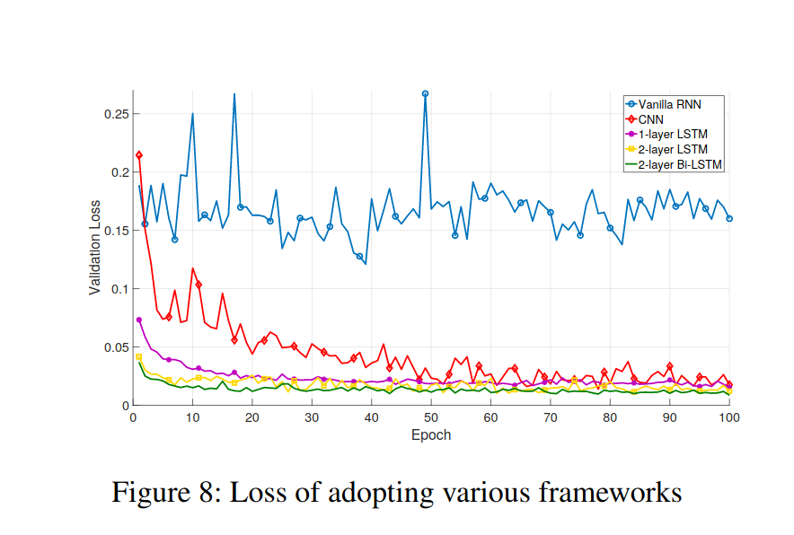

# Indoor mapping

## State of the art:

Pedestrian Dead Recogking aided with other techniques (floor plan, WiFi fingerprint, Magnetic Field)

Deep Learning based odometry: https://arxiv.org/pdf/1802.02209.pdf

LSTM tutorial: https://adventuresinmachinelearning.com/keras-lstm-tutorial/

Visual inertia odometry

## Progress report 

Data acquisition over UDP from smartphone: imu_over_udp.py

Fri

### Note section

INIM conference on indoor mapping and localization, may be really interesting.

